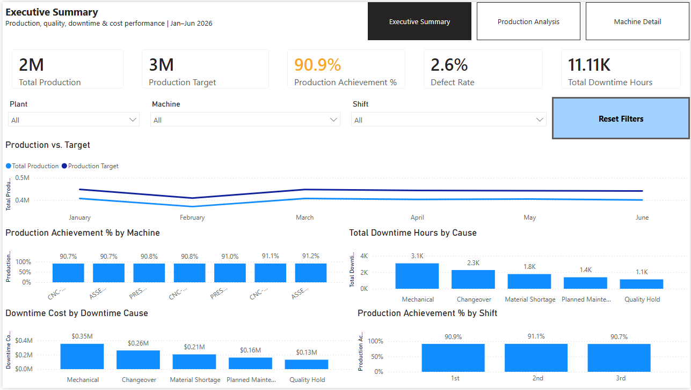
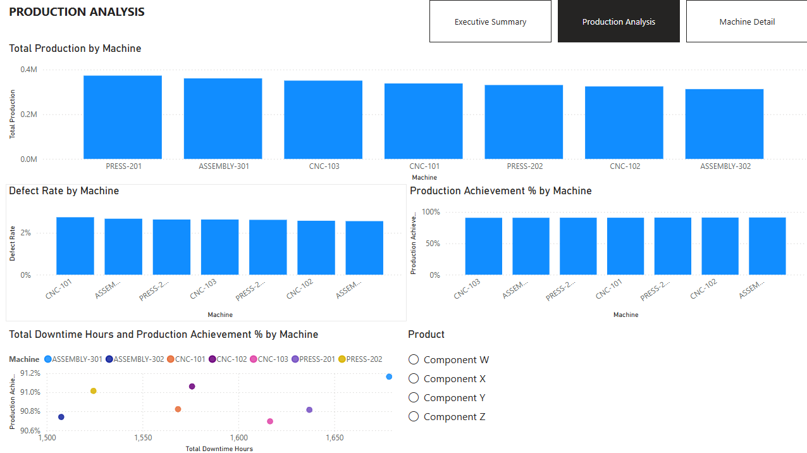
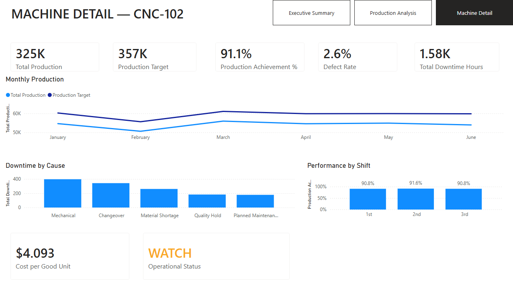

# manufacturing-operations-analysis
Statistical analysis of manufacturing operations data using Python, ANOVA, regression, and data visualization.

# Manufacturing Operations Analysis

## Overview

This project analyzes synthetic manufacturing operations data to identify factors associated with production volume, target achievement, and product quality.

The analysis uses exploratory data analysis, statistical testing, and regression modeling to distinguish between differences in absolute production and differences in operational performance relative to assigned production targets.

## Business Questions

The analysis addresses four questions:

1. Does absolute production differ across machines, shifts, or products?
2. Are those differences still present after accounting for production targets?
3. Does achievement differ across machines, shifts, or products?
4. Does quality differ across machines, shifts, or products?

## Key Findings

* Absolute production differed significantly across machines and shifts.
* Production targets were strongly associated with absolute production.
* After accounting for production targets, machine, shift, and product were no longer significant predictors of absolute production.
* Achievement Rate did not differ significantly across machines, shifts, or products.
* Quality Rate showed a statistically significant machine-level difference, but post-hoc comparisons indicated that the practical differences were very small.
* Overall quality was highly consistent across machines, with average Quality Rates clustered around approximately 97–97.5%.

## Analytical Approach

The project uses:

* Exploratory data analysis
* Descriptive statistics
* Correlation analysis
* One-way ANOVA
* Levene's test
* Welch's ANOVA
* Games-Howell post-hoc comparisons
* Ordinary Least Squares (OLS) regression
* Effect-size interpretation
* Data visualization

## Tools

* Python
* pandas
* NumPy
* SciPy
* statsmodels
* Pingouin
* Matplotlib
* Seaborn
* Jupyter Notebook

## Dataset

The dataset is synthetic and was created specifically for this portfolio project. It contains 7,602 manufacturing records covering machines, shifts, products, production targets, output, quality, defects, downtime, labor, and costs.

No confidential, proprietary, or personally identifiable information is included.

## Key Business Insight

A key finding is that absolute production volume can be misleading when production targets differ across operating conditions.

Although machines and shifts showed statistically significant differences in raw production output, those differences largely disappeared after accounting for production targets. Achievement Rate was similarly consistent across operating groups.

## Power BI Dashboard

The Power BI report provides an interactive view of manufacturing performance, including production output, target achievement, quality, downtime, and machine-level performance.

### Dashboard Overview

### Production Analysis

### Machine Detail

